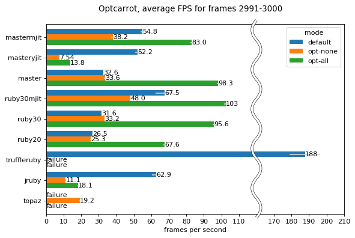

# Ruby implementation benchmark with Optcarrot

## Experimental conditions

* Core i7 4500U (1.80GHz) / Ubuntu 18.04
* Command: `ruby -v -Ilib -r./tools/shim bin/optcarrot --benchmark examples/Lan_Master.nes`
  * This runs the first 180 frames (three seconds), and prints the fps of the last ten frames.
  * `--benchmark` mode implies no GUI, so GUI overhead is not included.
  * [`tools/shim.rb`](../tools/shim.rb) is required for incompatibility of Ruby implementations.
  * `--opt` option is added for the optimized mode.
  * Furthermore, [`tools/rewrite.rb`](../tools/rewrite.rb) is used for some implementations (currently, Ruby 1.8 and Opal) to work with syntax incompatibility.  See [`tools/run-benchmark.rb`](../tools/run-benchmark.rb) in detail.
* Measured fps 10 times for each, and calculated the average over the runs.
* The error bars represent the standard deviation.

## Ruby implementations
* master: `ruby 3.0.0dev (2020-12-21T04:25:03Z master 74a7877836) [x86_64-linux]`
* ruby30: `ruby 3.0.0p0 (2020-12-25 revision 95aff21468) +JIT [x86_64-linux]`
* ruby27: `ruby 2.7.2p137 (2020-10-01 revision 5445e04352) [x86_64-linux]`
* ruby26: `ruby 2.6.6p146 (2020-03-31 revision 67876) [x86_64-linux]`
* ruby25: `ruby 2.5.8p224 (2020-03-31 revision 67882) [x86_64-linux]`
* ruby24: `ruby 2.4.10p364 (2020-03-31 revision 67879) [x86_64-linux]`
* ruby23: `ruby 2.3.8p459 (2018-10-18 revision 65136) [x86_64-linux]`
* ruby22: `ruby 2.2.10p489 (2018-03-28 revision 63023) [x86_64-linux]`
* ruby21: `ruby 2.1.10p492 (2016-04-01 revision 54464) [x86_64-linux]`
* ruby20: `ruby 2.0.0p648 (2015-12-16 revision 53162) [x86_64-linux]`
* ruby193: `ruby 1.9.3p551 (2014-11-13 revision 48407) [x86_64-linux]`
* ruby187: `ruby 1.8.7 (2013-06-27 patchlevel 374) [x86_64-linux]`

* mastermjit, ruby\*mjit: ruby with `--jit`

* truffleruby: `truffleruby 20.1.0, like ruby 2.6.5, GraalVM CE JVM [x86_64-linux]`
* jruby: `jruby 9.2.14.0 (2.5.7) 2020-12-08 ebe64bafb9 OpenJDK 64-Bit Server VM 25.275-b01 on 1.8.0_275-b01 +indy +jit [linux-x86_64]`
  * `--server -Xcompile.invokedynamic=true` is specified.

* rubinius: `rubinius 3.107 (2.3.1 387c4887 2018-07-15 5.0.0git-929163d) [x86_64-linux-gnu]`

* mruby: `mruby 3.0.0preview (2020-10-16)`
  * Configured with `MRB_WITHOUT_FLOAT` option

* topaz: `topaz (ruby-2.4.0p0) (git rev 9287c22) [x86_64-linux]`
  * Failed to run the optimized mode maybe because the generated core is so large.

* opal: `Opal v1.0.5`
  * Failed to run the default mode because of lack of Fiber.

* ruruby: `9c3084b951b3ff9af48feb5c87881760fe3352e1`

See [`tools/run-benchmark.rb`](../tools/run-benchmark.rb) for the actual commands.

## Remarks

This benchmark may not be fair inherently.  Optcarrot is somewhat tuned for MRI since I developed it with MRI.

The optimized mode assumes that case statement is implemented with "jump table" if all `when` clauses have trivial immediate values such as Integer.  This is true for MRI, but it is known that [JRuby 9k](https://github.com/jruby/jruby/issues/3672) and [Rubinius](https://github.com/rubinius/rubinius-code/issues/2) are not (yet).  OMR preview also seems not to support JIT for `opt_case_dispatch` instruction.

## Hints for Ruby implementation developers

* This program is purely CPU-intensive.  Any improvement of I/O and GC will not help.

* As said in remarks, this program assumes that the implementation will optimize `case` statements by "jump-table".  Checking each clauses in order will be too slow.
  * Implementation note: In the optimized mode (`--opt` option), CPU/PPU evaluators consist of one loop with a big `case` statement dispatching upon the current opcode or clock.

* The hotspot is `PPU#run` and `CPU#run`.  The optimized mode replaces them with an automatically generated and optimized source code by using `eval`.
  * You can see the generated code with `--dump-cpu` and `--dump-ppu`.  See also [`doc/internal.md`](internal.md).

* The hotspot uses no reflection-like features except `send` and `Method#[]`.
  * Implementation note: CPU dispatching uses `send` in the default mode.  Memory-mapped I/O is implemented by exploiting polymorphism of `Method#[]` and `Array#[]`.

* If you are a MRI developer, you can reduce compile time by using `miniruby`.

~~~~
$ git clone https://github.com/ruby/ruby.git
$ cd ruby
$ ./configure
$ make miniruby -j 4
$ ./miniruby /path/to/optcarrot --benchmark /path/to/Lan_Master.nes
~~~~

## How to benchmark
### How to use optcarrot as a benchmark

With `--benchmark` option, Optcarrot works in the headless mode (i.e., no GUI), run a ROM in the first 180 frames, and prints the fps of the last ten frames.

    $ /path/to/ruby bin/optcarrot --benchmark examples/Lan_Master.nes
    fps: 26.74081335620352
    checksum: 59662

Or, you may want to use `bin/optcarrot-bench`.

    $ /path/to/ruby bin/optcarrot-bench     # measure average FPS for frames 171--180
    $ /path/to/ruby bin/optcarrot-bench3000 # measure average FPS for frames 2991--3000

By default, Optcarrot depends upon [ffi] gem.  The headless mode has *zero* dependency: no gems, no external libraries, even no stdlib are required.  Unfortunately, you need to use [`tools/shim.rb`](../tools/shim.rb) due to some incompatibilities between MRI and other implementations.

    $ jruby -r ./tools/shim.rb -Ilib bin/optcarrot --benchmark examples/Lan_Master.nes

### How to run the full benchmark

This script will build docker images for some Ruby implementations, run a benchmark on them, and create `benchmark/bm-latest.csv`.

    $ ruby tools/run-benchmark.rb all -m all -c 10
    $ ruby tools/run-benchmark.rb mastermjit,master,ruby27mjit,ruby27,ruby20,truffleruby,jruby,topaz -c 10 -m all -f 3000
    $ ruby tools/plot.rb benchmark/*-oneshot-180.csv benchmark/*-oneshot-3000.csv

Note that it will take a few hours.  If you want to specify target, do:

    $ ruby tools/run-benchmark.rb ruby24 -m all

If you want to try [rubyomr-preview][omr], you need to load its docker image before running the benchmark.

[ffi]: http://rubygems.org/gems/ffi
[omr]: https://github.com/rubyomr-preview/rubyomr-preview
