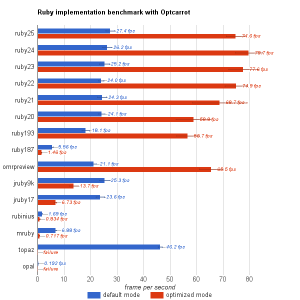

# Ruby implementation benchmark with Optcarrot

## Experimental conditions

* Core i7 4500U (1.80GHz) / Ubuntu 15.10
* Command: `ruby -v -Ilib -r./tools/shim bin/optcarrot --benchmark examples/Lan_Master.nes`
    * This runs the first 180 frames (three seconds), and prints the fps of the last ten frames.
    * `--benchmark` mode implies no GUI, so GUI overhead is not included. 
    * [`tools/shim.rb`](../tools/shim.rb) is required for incompatibility of Ruby implementations.
  * `--opt` option is added for the optimized mode.
* Measured fps 10 times for each, and calculated the average over the runs.
* The error bars represent the standard deviation.

## Ruby implementations

* ruby23: `ruby 2.3.1p112 (2016-04-26 revision 54768) [x86_64-linux]`
* ruby22: `ruby 2.2.5p319 (2016-04-26 revision 54774) [x86_64-linux]`
* ruby21: `ruby 2.1.9p490 (2016-03-30 revision 54437) [x86_64-linux]`
* ruby20: `ruby 2.0.0p648 (2015-12-16 revision 53162) [x86_64-linux]`
* ruby193: `ruby 1.9.3p551 (2014-11-13 revision 48407) [x86_64-linux]`
* ruby187: `ruby 1.8.7 (2013-06-27 patchlevel 374) [x86_64-linux]`

* omrpreview: `ruby 2.2.5p285 (Eclipse OMR Preview r1) (2016-03-29) [x86_64-linux]`
  * `OMR_JIT_OPTIONS='-Xjit'` is specified.

* jruby9k: `jruby 9.1.0.0 (2.3.0) 2016-05-02 a633c63 Java HotSpot(TM) 64-Bit Server VM 25.91-b14 on 1.8.0_91-b14 +indy +jit [linux-x86_64]`

* jruby17: `jruby 1.7.25 (1.9.3p551) 2016-04-13 867cb81 on Java HotSpot(TM) 64-Bit Server VM 1.8.0_91-b14 +indy +jit [linux-amd64]`
  * `--server -Xcompile.invokedynamic=true` is specified.

* rubinius: `rubinius 3.33 (2.2.2 db6f477e 2016-05-23 3.6.0) [x86_64-linux-gnu]`

* mruby: `mruby 1.2.0 (2015-11-17)`
  * Patched so that `Fixnum#/` returns an Integer instead of Float.

* topaz: `topaz (ruby-1.9.3p125) (git rev 019daf0) [x86_64-linux]`
  * Failed to run the optimized mode maybe because the generated core is so large.

* opal: `Opal v0.10.0.beta3`
  * Failed to run the default mode because of lack of Fiber.

See [`tools/run-benchmark.rb`](../tools/run-benchmark.rb) for the actual commands.

## Remarks

This benchmark may not be fair inherently.  Optcarrot is somewhat tuned for MRI since I developed it with MRI.

The optimized mode assumes that case statement is implemented with "jump table" if all `when` clauses have trivial immediate values such as Integer.  This is true for MRI, but it is known that [JRuby 9k](https://github.com/jruby/jruby/issues/3672) and [Rubinius](https://github.com/rubinius/rubinius-code/issues/2) are not (yet).  OMR preview also seems not to support JIT for `opt_case_dispatch` instruction.

## Hints for Ruby implementation developers

* This program is purely CPU-intensive.  Any improvement of I/O and GC will not help.

* As said in remarks, this program assumes that the implementation will optimize `case` statements by "jump-table".  Checking each clauses in order will be too slow.
  * Implementation note: In the optimized mode (`--opt` option), CPU/PPU evaluators consist of one loop with a big `case` statement dispatching upon the current opcode or clock.

* The hotspot is `PPU#run` and `CPU#run`.  The optimized mode replaces them with an automatically generated and optimized source code by using `eval`.
  * You can see the generated code with `--dump-cpu` and `--dump-ppu`.  See also [`doc/internal.md`](internal.md).

* The hotspot uses no reflection-like features except `send` and `Method#[]`.
  * Implementation note: CPU dispatching uses `send` in the default mode.  Memory-mapped I/O is implemented by exploiting polymorphism of `Method#[]` and `Array#[]`.

* If you are a MRI developer, you can reduce compile time by using `miniruby`.

~~~~
$ git clone https://github.com/ruby/ruby.git
$ cd ruby
$ ./configure
$ make miniruby -j 4
$ ./miniruby /path/to/optcarrot --benchmark /path/to/Lan_Master.nes
~~~~

## How to benchmark
### How to use optcarrot as a benchmark

With `--benchmark` option, Optcarrot works in the headless mode (i.e., no GUI), run a ROM in the first 180 frames, and prints the fps of the last ten frames.

    $ /path/to/ruby bin/optcarrot --benchmark examples/Lan_Master.nes
    fps: 26.74081335620352
    checksum: 59662

By default, Optcarrot depends upon [ffi][ffi] gem.  The headless mode has *zero* dependency: no gems, no external libraries, even no stdlib are required.  Unfortunately, you need to use [`tools/shim.rb`](../tools/shim.rb) due to some incompatibilities between MRI and other implementations.

    $ jruby -r ./tools/shim.rb -Ilib bin/optcarrot --benchmark examples/Lan_Master.nes

### How to run the full benchmark

This script will build docker images for some Ruby implementations, run a benchmark on them, and create `benchmark/bm-latest.csv`.

    $ ruby tools/run-benchmark.rb all -m all -c 10

Note that it will take a few hours.  If you want to specify target, do:

    $ ruby tools/run-benchmark.rb ruby23 -m all

If you want to try [rubyomr-preview][omr], you need to load its docker image before running the benchmark.

[ffi]: http://rubygems.org/gems/ffi
[omr]: https://github.com/rubyomr-preview/rubyomr-preview
